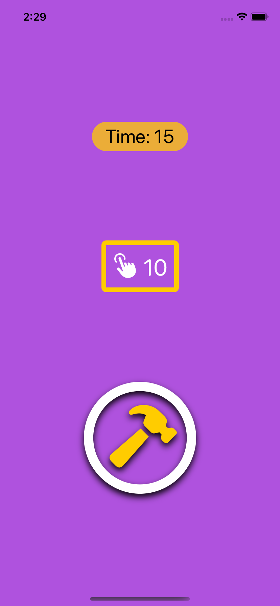

# Tapper

## Table of Contents
* [Description](#description)
* [Screenshots](#screenshot)
* [Installation](#installation)
* [Usage](#usage)
* [Code](#code)
* [Contact](#contact)
* [Technologies](#technologies)
* [Project Status](#project-status)

## Description 
This simple app for iOS and iPadOS allows a user to tap a button as many times as possible in 20 seconds. The highest score is saved to UserDefaults. State management is used to prevent the timer from continuing to count down while the app is not in the foreground.

## Screenshots

## Installation
Tapper is not currently published to the App Store; deploy to a device or Simulator using Xcode

## Usage
Press the play button to begin; tap the hammer button until the timer expires

## Code
[GitHub Code Repository](https://github.com/Johny49/tapper)

## Contact 
Created by [@johny49](https://github.com/Johny49/) - feel free to contact me!

## Technologies
- SwiftUI
- Combine

## Project Status
Project is: functional but in development
